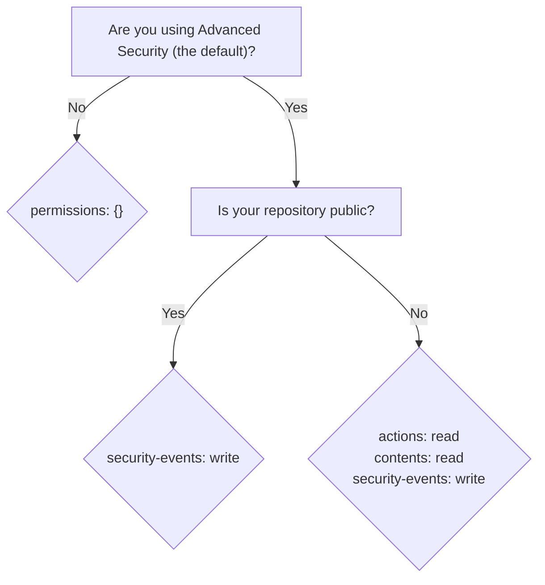

# zizmor-action 🌈

Run [`zizmor`] from GitHub Actions!

> [!WARNING]
> This action is not ready for public use!

## Table of Contents

- [Quickstart](#quickstart)
  - [Usage with Github Advanced Security (recommended)](#usage-with-github-advanced-security-recommended)
  - [Usage without Github Advanced Security](#usage-without-github-advanced-security)
- [Inputs](#inputs)
  - [`inputs`](#inputs)
  - [`online-audits`](#online-audits)
  - [`version`](#version)
  - [`token`](#token)
  - [`advanced-security`](#advanced-security)
- [Permissions](#permissions)
- [Troubleshooting](#troubleshooting)

## Quickstart

This section lists a handful of quick-start examples to get you up and
running with `zizmor` and `zizmor-action`. See the [Inputs](#inputs)
section for more details on how `zizmor-action` can be configured.

If you run into any issues, please see the [Troubleshooting] section!

### Usage with Github Advanced Security (recommended)

> [!IMPORTANT]
> This mode requires that your repository is public or that you have
> [Advanced Security] as a paid feature on your private repository.
>
> If neither of these applies to you, you can use `zizmor-action`
> with `advanced-security: false`; see below for more details.

> [!IMPORTANT]
> In this mode, the action will **not** fail when `zizmor` produces findings.
> This is because Advanced Security encourages workflows to only fail
> on internal errors.
>
> To use workflow failure as a blocking signal, you can use GitHub's rulesets
> feature. For more information, see
> [About code scanning alerts - Pull request check failures for code scanning alerts].

> [!NOTE]
> This is the recommended way to use `zizmor-action` as it provides
> stateful analysis and enables incremental triage.

`zizmor-action` integrates with GitHub's [Advanced Security]
by default, giving you access to `zizmor`'s findings via your
repository's security tab.

```yaml
name: GitHub Actions Security Analysis with zizmor 🌈

on:
  push:
    branches: ["main"]
  pull_request:
    branches: ["**"]

permissions: {}

jobs:
  zizmor:
    runs-on: ubuntu-latest
    permissions:
      security-events: write
      contents: read # only needed for private repos
      actions: read # only needed for private repos
    steps:
      - name: Checkout repository
        uses: actions/checkout@11bd71901bbe5b1630ceea73d27597364c9af683 # v4.2.2
        with:
          persist-credentials: false

      - name: Run zizmor 🌈
        uses: zizmorcore/zizmor-action@2520132f44b3ed84916048d32e5c7153fc739fe7 # v0.0.3
```

### Usage without Github Advanced Security

If you can't or don't want to use GitHub's [Advanced Security] functionality,
you can still use `zizmor-action` without any issues or feature limitations!

To do so, you can set `advanced-security: false`
and omit the `security-events: write` permission. For example:

```yaml
name: GitHub Actions Security Analysis with zizmor 🌈

on:
  push:
    branches: ["main"]
  pull_request:
    branches: ["**"]

permissions: {}

jobs:
  zizmor:
    runs-on: ubuntu-latest
    permissions:
      contents: read # only needed for private repos
      actions: read # only needed for private repos
    steps:
      - name: Checkout repository
        uses: actions/checkout@11bd71901bbe5b1630ceea73d27597364c9af683 # v4.2.2
        with:
          persist-credentials: false

      - name: Run zizmor 🌈
        uses: zizmorcore/zizmor-action@2520132f44b3ed84916048d32e5c7153fc739fe7 # v0.0.3
        with:
          advanced-security: false
```

## Inputs

### `inputs`

*Default*: `.`

`inputs` is a whitespace-separated list of inputs to pass to `zizmor`.
It defaults to `.` (the current working directory).

This set of inputs can be anything `zizmor` would normally accept as an
input. For example, you can audit one or more files, directories, or remote
repositories:

```yaml
- name: Run zizmor 🌈
  uses: zizmorcore/zizmor-action@2520132f44b3ed84916048d32e5c7153fc739fe7 # v0.0.3
  with:
    inputs: |
      .github/workflows/fishy.yml
      my-actions/
      other-org/other-repo@main
```

See `zizmor`'s [Input collection] documentation for more information.

### `online-audits`

*Default*: `true`

`online-audits` controls whether `zizmor` runs online audits. Running without
`online-audits` is faster but will produce fewer results.

See `zizmor`'s [Audit Rules] documentation for more information on which
audits are online-only.

### `persona`

*Default*: `regular`

`persona` is the auditing "persona" to apply during audits.

It can be set to one of the following values: `regular` (the default),
`pedantic`, or `auditor`.

See `zizmor`'s [Using personas] documentation for more information
on what each persona does.

### `min-severity`

*Default*: none

`min-severity` controls the severity threshold for reported findings;
findings below the threshold will be ignored.

It can be set to one of the following values: `unknown`, `informational`,
`low`, `medium`, or `high`.

See `zizmor`'s [Filtering results] documentation for more information.

### `min-confidence`

*Default*: none

`min-confidence` controls the confidence threshold for reported findings;
findings below the threshold will be ignored.

It can be set to one of the following values: `unknown`, `low`, `medium`,
or `high`.

See `zizmor`'s [Filtering results] documentation for more information.

### `version`

*Default*: `latest`

`version` is the version of `zizmor` to use. It must be provided as
either an exact version (e.g. `v1.7.0`) or the special value `latest`,
which will always use the latest version of `zizmor`.

### `token`

*Default*: `${{ github.token }}`

`token` is the GitHub token to use for accessing the GitHub REST API
during online audits, as well as for uploading results to Advanced Security
when [`advanced-security`](#advanced-security) is enabled.

### `advanced-security`

*Default*: `true`

`advanced-security` controls whether `zizmor-action` uses GitHub's
[Advanced Security] functionality. If set to `false`, `zizmor-action`
will not upload results to Advanced Security, and will instead
print them to the console.

## Permissions

`zizmor-action` requires different permissions depending on how you use it.

The following table summarizes the permissions required and when:

| Permission | Description | Required when? |
| ---------- | ----------- | --------------- |
| `security-events: write` | Required to upload results to [Advanced Security]. | When `advanced-security: true` (the default). |
| `contents: read` | Required to read the contents of the repository. | When `advanced-security: true` *and* the parent repository is private. |
| `actions: read` | Required to read the actions of the repository. | When `advanced-security: true` *and* the parent repository is private. |

Or, as a decision tree:



## Troubleshooting

### "Cannot run this action without Docker"

This action uses a container to run `zizmor`, which means that it
needs access to a container runtime (like Docker).

If you see this error, it _probably_ means that you are running the
action from a self-hosted runner, or from one of the GitHub-hosted runners
that does not have Docker installed. For example, the GitHub-hosted
macOS runners do not have Docker installed by default.

For self-hosted runners, you should install Docker (or a compatible
container runtime) onto the runner.

For GitHub-hosted runners, you should switch to `ubuntu-latest` or another
Linux-based runner that comes with Docker by default. You _may_ be
able to use [docker/setup-docker-action] to install Docker on other runners,
but this is **not officially supported** by this action.

[`zizmor`]: https://docs.zizmor.sh
[Advanced Security]: https://docs.github.com/en/get-started/learning-about-github/about-github-advanced-security
[About code scanning alerts - Pull request check failures for code scanning alerts]: https://docs.github.com/en/code-security/code-scanning/managing-code-scanning-alerts/about-code-scanning-alerts#pull-request-check-failures-for-code-scanning-alerts
[Input collection]: https://docs.zizmor.sh/usage/#input-collection
[Audit Rules]: https://docs.zizmor.sh/audits/
[Using personas]: https://docs.zizmor.sh/usage/#using-personas
[Filtering results]: https://docs.zizmor.sh/usage/#filtering-results
[docker/setup-docker-action]: https://github.com/docker/setup-docker-action
